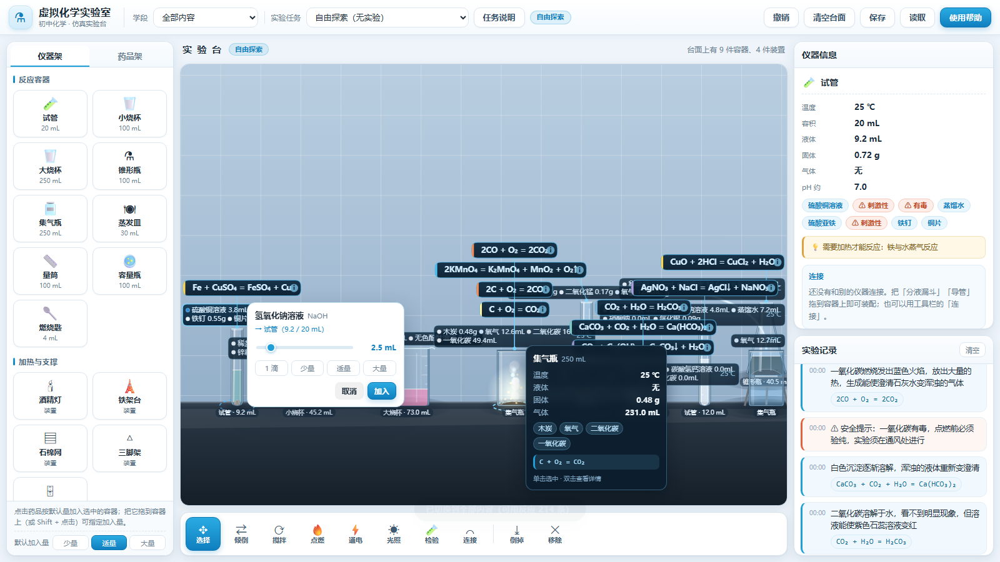
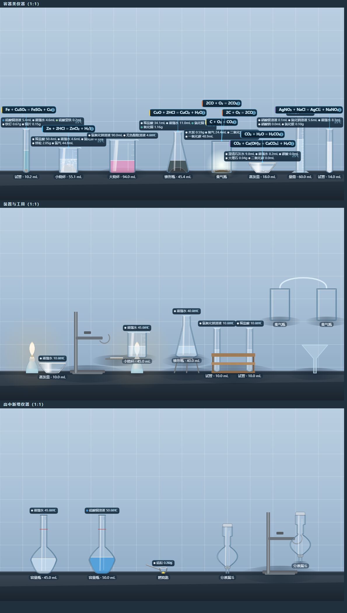
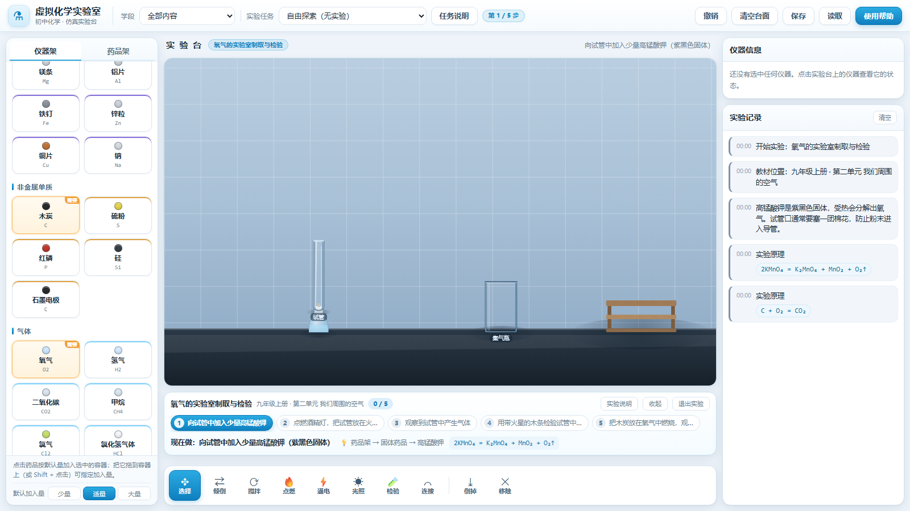
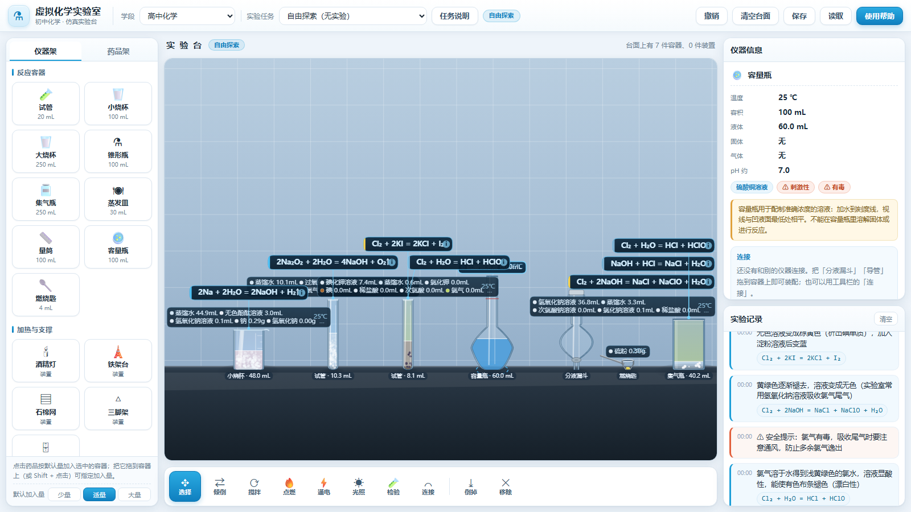
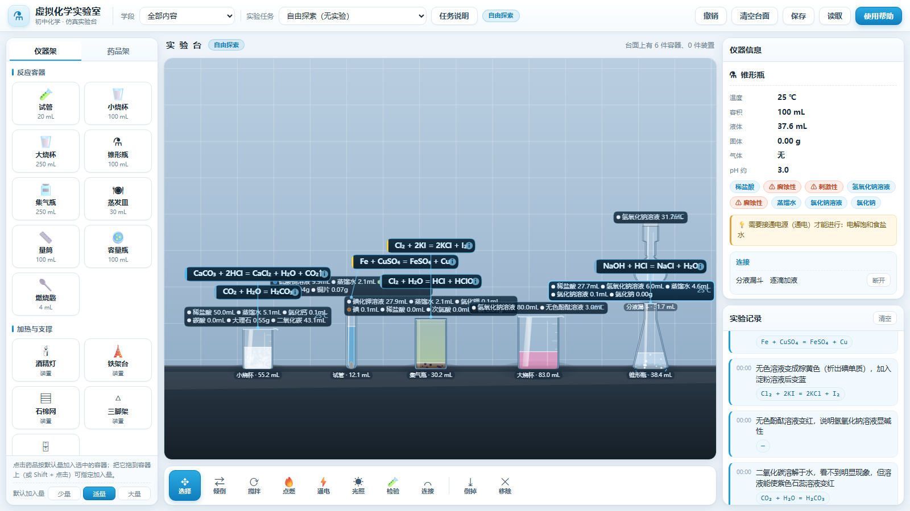
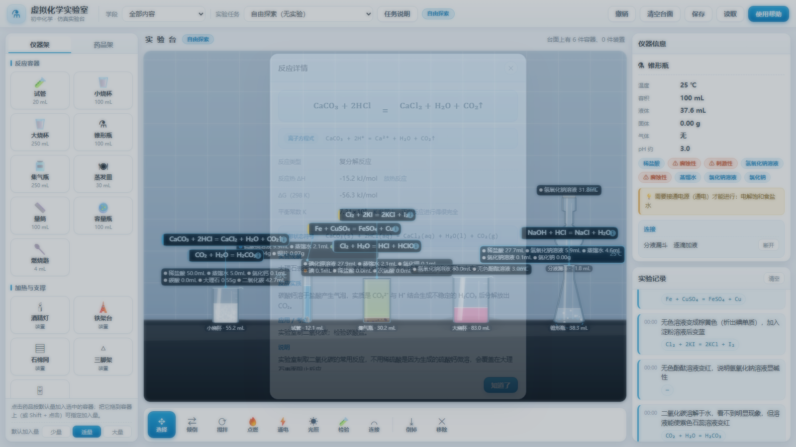
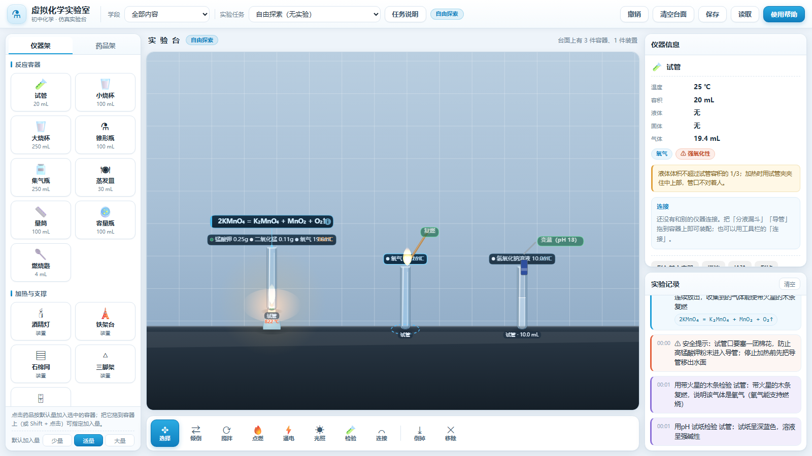
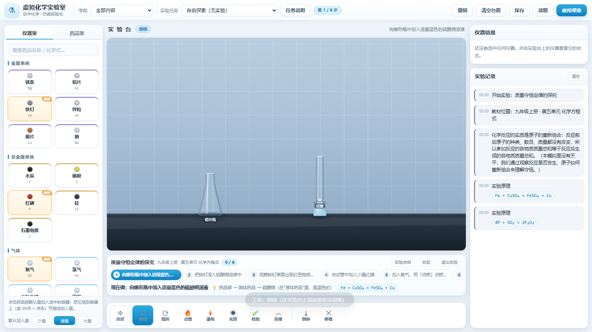

# 虚拟实验室（Virtual Lab）· 化学 + 物理

一个**离线可用**的中学理化仿真实验软件，参考 NB 实验室的交互方式：

- **化学**：从仪器架和药品架取用器材，在实验台上自由搭建装置，倾倒、滴加、加热、搅拌、点燃、通电、
  光照、导气、检验，实时看到气泡、沉淀、变色、白烟、火焰、浑浊等真实现象，并同步给出**实验现象**与**化学方程式**。
- **物理**：顶栏切到「物理」即进入**另一套完全独立的界面**（货架、画布、控制条全部接管），
  按「力学 / 声学 / 热学 / 光学 / 电学 / 电磁学 / 近代物理」选主题，做电路、透镜、杠杆、打点计时器、
  熔化沸腾、浮力、电磁感应、光电效应等实验，读数与图像实时更新。

- 纯前端，零依赖，零构建，双击即用
- **初中 / 高中两套内容可自由切换**，互不干扰（引擎层面真正隔离，不只是隐藏货架）
- **化学**：214 条反应规则、162 种物质、36 种仪器，全部通过元素守恒校验与逐条仿真验证
- **物理**：**20 个**仿真主题、**24 个**教材实验（初中 14 + 高中 10），每一步都通过「照着做一遍」的可达性校验
- **教材实验库**：初高中理化教材实验带实验流程指引，选中即自动摆好器材并逐步引导
- 把药品**拖到容器上**就能自定义加入量；鼠标**悬停**即可查看容器状态
- 容器反应时**旁边自动标出化学方程式**，点一下看**焓变 ΔH、平衡常数 K、离子方程式**
- 仪器之间可以**连接装配**（导管导气、分液漏斗逐滴加液、漏斗引流），随时断开
- 在实验台上**滚动滚轮切换工具**
- 化学 1151 项引擎断言 + 34 个教材实验的逐步可行性校验；
  物理 **1666 项**断言（含 24 个实验每一步的逐步可达性、三种画布尺寸下的绘制越界检查、
  362 组「控制项 × 画布尺寸」穷举、指针扫格验证拖拽命中、
  以及按"形状实际范围"核对的**构图比例**检查）；
  界面冒烟 **332 项**断言（含物理学科切换、做实验、切回化学的完整链路）

















---

## 一、怎么运行

### 方式 1：直接打开（最快）
双击 `index.html`。全部脚本都是传统 `<script>`，不受 ES module 在 `file://` 下的跨域限制，
所以浏览器能直接跑。

> 注意：部分浏览器在 `file://` 下会禁用 `localStorage`，此时顶栏的「保存 / 读取」不可用，
> 其余功能不受影响。想要完整功能请用方式 2。

### 方式 2：本地服务器（推荐）
```bash
cd chemlab
node serve.mjs          # 默认 http://127.0.0.1:5178
node serve.mjs 8080     # 或指定端口
```
然后用浏览器打开提示的地址。只依赖 Node 内置模块，不需要 `npm install`。

---

## 二、怎么用

### 学科切换
顶栏最左边的「学科」下拉框在 **化学 / 物理** 之间切换。切到物理之后，左栏、实验区、工具栏位置
会被物理模块整体接管（详见「四、物理内容覆盖」），化学那一套原样留着，随时切回来。

两个学科共用顶栏、右侧面板、实验记录和「实验任务」流程指引栏，所以做实验的体验是一致的：
选实验 → 自动摆好器材 → 步骤条逐步引导 → 自动打勾 → 完成后给 🎉。

### 学段切换
「学段」下拉框的内容会跟着学科变：

- 化学：**初中化学 / 高中化学 / 全部内容**
  - **初中化学**：九年级内容（常见的酸、碱、盐、金属、气体制取与性质）
  - **高中化学**：元素化合物、有机化学基础、电化学、离子反应
  - **全部内容**：两套内容同时可用
  - 切换会同时改变**反应规则**、**药品架**、**仪器架**和**实验任务**，互不干扰。
- 物理：**初中物理 / 高中物理 / 全部内容**
  - 切换会改变左侧「物理仿真」里列出的主题，以及「实验任务」里的实验清单。

### 搭装置
点左侧「仪器架」里的仪器即可放到实验台；也可以直接把它拖到台面指定位置。
台面上的仪器可以按住拖动，「试管」拖到「试管架」上会自动入槽。

### 加药品
三种方式，从快到慢：

| 方式 | 操作 | 加入量 |
|---|---|---|
| 快速 | 选中容器后点药品 | 按左下的「默认加入量」（少量 / 适量 / 大量）自动换算 |
| 精确 | **把药品拖到容器上** | 松手后弹出滑块，可精确定量，还有 1 滴 / 少量 / 适量 / 大量的快捷键 |
| 精确 | **Shift + 点击药品** | 同上 |

拖动时鼠标下的容器会亮起绿圈，明确告诉你药品会加到哪一个容器里。

### 查看容器状态
两种方式，互补：

- **直接看容器上方**——每个装有东西的容器，口上都贴着一张**内容物标注**，写明里面有什么、
  什么状态、多少量、多少度，例如 `⬤高锰酸钾 0.25g ⬤二氧化锰 0.11g ⬤氧气 198mL ● 25℃`。
  它紧贴着容器口画（离容器最近），**方程式卡片再往上叠**，形成"物质 → 正在发生的反应"
  从下往上的阅读顺序，两者不会互相压住；空容器不显示标注，免得台面上一堆空标签。
- **鼠标移到容器上**——浮出状态气泡：名称与容积、温度（是否沸腾）、液体 / 固体 / 气体的量与种类、
  pH、成分标签，以及"当前正在发生什么反应"或"还差什么条件"。单击选中，双击看详细说明。
  拖动容器时气泡会**一直跟着鼠标走**。

### 检验
用「检验」工具时**不弹一段文字，而是在容器口演一遍动画**：

- **木条类**：一根木条伸进容器，带火星的遇到氧气会**复燃**（画出跳动的火焰），
  否则火星逐渐暗下去、熄灭；旁边标出"复燃"或"熄灭"。
- **试纸类**：一条试纸伸进容器口，颜色按结果变化——pH 试纸按实际 pH 变成红 / 橙 / 黄 / 绿 / 蓝，
  石蕊按酸碱性变红或变蓝；旁边标出"变蓝（pH 13）"这样的结果。

动画约 2 秒，分"伸入 → 停留观察 → 抽走"三段；完整结论仍然记进右侧实验记录。

### 看懂正在发生的反应
某个容器里在反应时，它的**正上方会自动贴出一张方程式卡片**（例如 `CaCO₃ + 2HCl = CaCl₂ + H₂O + CO₂↑`），
同一个容器有多条反应就叠着排。卡片有颜色条区分现象类型（气泡 / 沉淀 / 变色 / 火焰……），
反应停下来几秒后淡出。

**点一下卡片**就打开反应详情：

| 内容 | 说明 |
|---|---|
| 方程式 | 反应条件写在等号正上方（点燃 / 加热 / 高温 / 通电 / 光照 / 催化剂） |
| 离子方程式 | 离子反应给出删去旁观离子后的净离子方程式 |
| 反应热 ΔH | 由标准生成焓算出，并给出"放热 / 吸热"的解读 |
| 平衡常数 K | 由 ΔG° = −RT ln K 算出，并说明"平衡偏向哪一边" |
| 带状态符号的方程式 | 例如 `CaCO₃(s) + 2HCl(aq) = CaCl₂(aq) + H₂O(l) + CO₂(g)` |
| 实验现象 / 反应实质 / 应用考点 / 安全提示 | |
| 当前容器 | 该容器此刻的温度与成分 |

### 焓变与平衡常数是怎么算出来的
`js/data/thermo.js` 给每个**母体物质**存了一组标准数据 `[ΔHf°, ΔGf°]`（kJ/mol，298.15 K，1 bar，
溶液用 aq、沉淀用固态、气体用气态）。反应量按下面的方式计算：

```
ΔH°rxn = Σ n·ΔHf°(生成物) − Σ n·ΔHf°(反应物)
ΔG°rxn = Σ n·ΔGf°(生成物) − Σ n·ΔGf°(反应物)
K = exp(−ΔG°rxn / RT)          T = 298.15 K
```

几个关键的设计决定：

1. **化学计量取自配平的化学方程式本身，而不是 `reactants` / `ratio`**。
   因为有 10 条规则的方程式里含有没写进 `reactants` 的参与物（大多是水），
   例如 `2Al + 2NaOH + 2H₂O = 2NaAlO₂ + 3H₂↑`，只按 `reactants` 算会漏掉水，结果差一大截。
2. **弱电解质取"分子在水中的标准态"而不是"完全电离后离子之和"**。
   H₂CO₃ 如果按 H⁺ + HCO₃⁻ 的加和数据算，Ka 就被抹掉了，ΔG 会差 95 kJ/mol、K 差几十个数量级。
   这条规则对 HF / HClO / H₂CO₃ / H₂SO₃ / H₂O₂ / NH₃·H₂O 生效。
3. **K < 1 时必须解释"那它为什么还能进行"**。像电解水、石灰石高温分解、氧化铁溶于盐酸
   这些反应，在标准状态下 K 是小于 1 的，但实验里确实做得到。详情面板会针对原因分别说明：
   由电能驱动 / 由高温驱动 / 生成物不断被移走使平衡正移。**不能只甩一个数字给学生。**

用教科书上查得到的值校准过：中和热 −56.7（教科书 −57.3）、电解水 +571.6（+571.6）、
镁燃烧 −1203.4、酯化反应 K = 7.5（实测约 4）。

### 连接仪器
实验装置是可以**装配**起来的，有三种连接方式：

| 连接 | 怎么做 | 效果 |
|---|---|---|
| 导管（导气） | 把「导管」拖到容器上；或用「连接」工具先点导管再点容器；或先点一个容器再点另一个容器（自动加导管） | 产生的气体在两个容器之间流通 |
| 分液漏斗（加液） | 把「分液漏斗」拖到容器上 | 自动停靠到容器正上方，里面的液体**逐滴**流进下面的容器 |
| 漏斗（引流） | 把「漏斗」拖到容器上 | 往漏斗里倒的液体会流进下面的容器 |

选中任意一件仪器，右侧「仪器信息」里会有一个**连接**区，列出它接了谁、接的是哪种方式，
每条连接后面都有**断开**按钮。

### 底部工具栏
| 工具 | 作用 |
|---|---|
| 选择 | 选中 / 拖动仪器（**拖动只在选择模式下生效**） |
| 倾倒 | 点一次源容器，再点一次接收容器；也可以把一个容器直接拖到另一个容器口内 |
| 搅拌 | 加快溶解和反应速率 |
| 点燃 | 点酒精灯点燃 / 盖灭；点装有可燃物的容器点燃其中物质 |
| 通电 | 给装水的容器接通直流电源（电解水），再点一次断电 |
| 光照 | 用强光照射容器（甲烷氯代、次氯酸分解、H₂+Cl₂ 等需要光照） |
| 检验 | 带火星木条 / 燃着的木条 / 紫色石蕊试纸 / pH 试纸 |
| 连接 | 装配仪器：导管导气、分液漏斗加液、漏斗引流 |
| 倒掉 | 倒空容器 |
| 移除 | 把仪器从台面拿走 |

**在实验台上滚动鼠标滚轮就能依次切换工具**——按滚动位移累积，每攒够一格（120）切一个工具，
所以连滚三格就连切三个，不会被冷却时间吃掉；触控板那种细碎增量也是攒够一格切一个，同样跟手。
切到哪个会弹出提示。快捷键：`1`~`9`、`0` 对应上述工具，`Delete` 移除选中仪器，`Esc` 关闭浮层。

### 做教材实验
顶栏「实验任务」下拉框按 **初中实验 / 高中实验** 分了两组，**选中哪个实验就会自动切到对应学段**，
不用先去改学段。选中后实验区下方会出现**实验流程指引栏**：

```
氧气的实验室制取与检验  九年级上册 · 第二单元 我们周围的空气        0 / 5
[① 向试管中加入少量高锰酸钾] [② 点燃酒精灯，把试管放在火…] [③ 观察到试管中产生气体] …
现在做：向试管中加入少量高锰酸钾（紫黑色固体）
💡 药品架 → 固体药品 → 高锰酸钾        2KMnO₄ = K₂MnO₄ + MnO₂ + O₂↑
```

- **步骤轨道**：所有步骤一眼看全，已完成的打 ✓、当前步骤高亮成蓝色，可以横向滚动
- **当前步骤**：写清"现在做什么"和"去哪里点"，刚开始两步还会把实验原理的方程式摆出来
- **点任意一步**可以回顾它的说明（不影响进度），再点一次取消
- **实验说明**按钮打开完整版：实验目的、教材位置、实验原理（全部方程式）、每一步的提示
- **本实验需要**：药品架上这个实验要用到的药品会被**标出来**（橙色描边 + "需要"角标），
  并自动把货架切到药品页、滚动到第一个需要的药品；指引栏里也列一份清单，点一下就能滚过去
- 每完成一步自动打勾进入下一步；全部完成后给 🎉 提示
- **收起 / 退出实验**：收起只留标题一行；退出回到自由探索，实验台清空，药品架上的标记也一并清除

### 加热
先放好「酒精灯」并用「点燃」点亮，再把容器移到火焰上方。

- **试管、蒸发皿、燃烧匙**可以直接加热；
- **烧杯、锥形瓶**必须垫「石棉网」，否则会加热失败并给出原因；
- **量筒、集气瓶、容量瓶**不能加热，真的放到火焰上会提示炸裂风险。

有水时容器会稳定在 100 ℃ 并沸腾、缓慢蒸干；没有液体时温度会继续升到几百度。

### 引导任务
顶栏「实验任务」下拉框里的实验按初高中分组，选中后自动摆好仪器、自动切到对应学段，
实验区下方出现**实验流程指引栏**逐步指引完成（详见上一节）。

一共 **34 个教材实验**（初中 19 + 高中 15），全部带教材章节与实验原理方程式：

- **初中**：对人体吸入和呼出气体的探究、分子运动现象、水的组成（电解）、水的净化（过滤与吸附）、
  质量守恒定律、燃烧条件、给物质加热、配制一定溶质质量分数的溶液、酸碱指示剂与溶液酸碱性、
  酸和碱的化学性质、溶液酸碱度的检验、粗盐中难溶性杂质的去除、常见离子的检验、
  氧气的制取与检验、二氧化碳的制取与检验、酸碱中和、金属活动性顺序、铁与硫酸铜、碳酸钠的酸碱性
- **高中**：钠及其化合物、氯气的性质与氯水、配制一定物质的量浓度的溶液、铁及其化合物的转化、
  氨的制取与性质、二氧化硫的性质、硝酸的性质、铝及其化合物的性质、硅与硅酸盐、
  乙醇的催化氧化与酯化、葡萄糖的检验与淀粉的性质、原电池原理、电解氯化铜溶液、
  离子反应与离子方程式、影响化学反应速率的因素

---

## 三、化学内容覆盖

一共 **214 条**反应规则，物质 **162 种**，仪器 36 种。

- `js/data/reactions.js` —— 初中 98 条
- `js/data/reactions-senior.js` —— 高中 91 条
- `js/data/reactions-extra.js` —— 补充 25 条：**气体的实验室制法**（MnO₂ + 浓盐酸制氯气、
  NH₄Cl + Ca(OH)₂ 制氨气、Na₂SO₃ + 浓硫酸制 SO₂、FeS + 稀硫酸制 H₂S）、
  **有机物的检验与转化**（乙醛的银镜反应、乙醛与新制 Cu(OH)₂、蔗糖水解、乙烯与 HCl 加成、
  乙炔水化制乙醛、苯的磺化）、以及若干元素化合物反应（铝热反应、侯氏制碱法、钙与过量 CO₂、
  Fe²⁺ 与碱生成白色 Fe(OH)₂ 等）。

### 初中（98 条）**反应类型**：化合 14、分解 10、置换 20、复分解 39、氧化还原 4、其他 11。

镁/铁/铝/碳/硫/磷/氢气/一氧化碳/甲烷/乙醇的燃烧；高锰酸钾、氯酸钾、过氧化氢、
电解水制氧气；碳酸钙高温分解、碳酸氢钠与碳酸氢铵受热分解、碱式碳酸铜受热分解；
金属与稀酸、金属与盐溶液的置换；金属氧化物与酸；酸碱中和；酸与盐；碱与盐；盐与盐；
二氧化碳与氢氧化钠/氢氧化钙；氢气、碳、一氧化碳还原氧化铜与氧化铁；铁与硫化合；
指示剂（酚酞、石蕊、甲基橙）显色。

### 高中（91 条 + 补充 25 条）
- **钠及其化合物**：Na + H₂O、Na + O₂（常温/点燃）、Na₂O₂ + H₂O/CO₂、Na₂O + H₂O/HCl
- **铝**：Al + NaOH、Al₂O₃/Al(OH)₃ + NaOH、AlCl₃ + 氨水、NaAlO₂ + CO₂/HCl、铝热反应
- **铁**：Fe + Cl₂、Fe + 水蒸气、Fe(OH)₂ 被氧化、Fe³⁺ + KSCN 显色、Fe/Cu + FeCl₃
- **氯**：Cl₂ + H₂O/NaOH/石灰乳/Fe/Cu/H₂/KI/Na₂SO₃、HClO 见光分解、NaClO + CO₂
- **硫**：SO₂ + H₂O/O₂/氯水/酸性 KMnO₄、SO₃ + H₂O、H₂S 燃烧与 SO₂ 归中、Cu/C + 浓硫酸
- **氮**：N₂ + H₂ 合成氨、NH₃ + H₂O/HCl/CuO、NH₄Cl 受热分解、氨的催化氧化、
  NO + O₂、NO₂ + H₂O/NaOH、Cu + 浓/稀硝酸、Fe + 稀硝酸
- **硅**：Si + O₂/NaOH、SiO₂ + NaOH/CaCO₃/HF、Na₂SiO₃ + CO₂/HCl
- **有机**：甲烷氯代，乙烯加成（Br₂/H₂/H₂O）与加聚，乙炔加成与燃烧，
  苯的溴代/硝化/加氢，乙醇与钠/催化氧化/消去，乙酸与碳酸钠/NaOH/酯化，
  酯的水解，葡萄糖与 Cu(OH)₂ / 银氨溶液，淀粉水解与遇碘变蓝，油脂皂化，蛋白质变性
- **电化学**：电解 CuCl₂ 溶液、电解饱和食盐水

**同时建模了"不反应"**：铜与稀盐酸、铜与硫酸亚铁、铁与硫酸锌、碳酸钠与氯化钠等组合，
混合后会给出**为什么没有现象**的解释，而不是静默无反应。

**反应条件**都会真正生效：加热、点燃、催化剂（MnO₂ / Cu / Fe / 浓硫酸 / V₂O₅）、
水溶液环境、通电、光照、温度阈值。条件不满足时右侧「仪器信息」与悬停气泡会提示"还差什么"。

> **浓 / 稀酸是分开的物种**：浓硫酸、浓硝酸各有独立的 `base`，所以"铜与浓硫酸"的反应
> 不会被稀硫酸误触发，反过来也一样。

---

## 四、物理内容覆盖

一共 **20 个**仿真主题、**24 个**教材实验（初中 14 + 高中 10），按七个分支分组：

| 分支 | 主题 | 学段 |
|---|---|---|
| 力学 | 匀变速直线运动（打点计时器）、探究 a 与 F、m 的关系、研究平抛运动、验证机械能守恒、验证动量守恒、探究杠杆的平衡条件、探究重力与质量的关系、探究滑动摩擦力、压强、浮力（阿基米德原理） | 初 / 高 |
| 声学 | 声音的特性与传播（音调 / 响度 / 音色、真空不传声） | 初中 |
| 热学 | 熔化与沸腾（温度—时间图像）、气体的等温变化（玻意耳定律） | 初中 / 高中 |
| 光学 | 平面镜成像、凸透镜成像规律、光的反射与折射（含全反射） | 初中 / 高中 |
| 电学 | 电路连接与欧姆定律（伏安法测电阻、测电源电动势与内阻） | 初 / 高 |
| 电磁学 | 通电螺线管与电磁铁、电磁感应 | 初中 / 高中 |
| 近代物理 | 光电效应（测普朗克常量） | 高中 |

### 界面说明

切到「物理」之后，**左栏换成物理仿真主题架，实验区换成物理画布，工具栏位置换成参数控制条**，
右上「仪器信息」变成「读数与信息」；化学的货架、画布、工具栏被收起（`display:none`，
因此不影响布局），**化学引擎同时完全停摆**——不会在后台偷偷继续反应。

控制条由仿真自己声明（滑块 / 下拉框 / 按钮 / 提示文字），例如：

- 电路：表头读数实时刷新，可记录 U、I 并自动最小二乘拟合出 E 与 r
- 打点计时器：拖「小车质量 / 挂钩砝码」，点「释放小车」打出纸带，右侧自动列出计数点与 Δs
- 熔化沸腾：选「冰的熔化 / 水的沸腾」，加热功率与气压可调，温度—时间图像实时绘制，平台段一眼可见
- 光电效应：选金属、改频率与光强，测遏止电压并作 U_c–ν 图，斜率就是 h/e

画布上可以直接拖的对象：电路的元件与接线柱（点两个接线柱连线、点开关通断）、
透镜实验的蜡烛 / 透镜 / 光屏、光的反射与折射里的激光笔、杠杆的刻度（点一下挂一个杠码）、
平面镜成像里的蜡烛 A / 蜡烛 B（点一下蜡烛 A 点燃或熄灭）、玻意耳定律里的活塞。
其余仿真用控制条的滑块与按钮操作，画布上的注释也会写明"拖哪里"。

### 物理教材实验（24 个）

- **初中 14 个**：探究声音的特性与传播、探究冰熔化时温度的变化规律、观察水的沸腾、
  探究平面镜成像的特点、探究凸透镜成像的规律、探究光反射时的规律、探究重力与质量的关系、
  探究影响滑动摩擦力大小的因素、探究压力的作用效果、探究液体内部的压强、
  探究浮力的大小（阿基米德原理）、探究杠杆的平衡条件、探究通电螺线管的磁场、
  用电压表电流表测电阻（伏安法）
- **高中 10 个**：用打点计时器研究匀变速直线运动、探究加速度与力质量的关系、研究平抛运动、
  验证机械能守恒定律、验证动量守恒定律、探究气体等温变化的规律、
  测量电源的电动势和内阻、测定玻璃的折射率、探究电磁感应现象、光电效应与普朗克常量

每条实验都带**教材章节、实验目的、实验原理（公式）**，步骤条与化学实验完全一致：
已完成的打 ✓、当前步骤高亮、点任意一步可以回顾，还能打开「实验说明」看完整版。

### 物理的真实性

不是"画个动画"，关键量都是真算的：

| 内容 | 怎么算的 |
|---|---|
| 电路 | 改进节点法（MNA + 诺顿等效）解线性方程组，带电源内阻、电流表 0.05 Ω、电压表 100 kΩ，表头读数可信；支持短路 / 断路判断、灯泡按实际功率发光 |
| 打点计时器 | 50 Hz 打点，每 5 个间隔取计数点（T = 0.1 s），逐差法求 a |
| 平抛 | 频闪点按 x = v₀t、y = h − ½gt² 生成，可与自由落体同步对比 |
| 熔化 / 沸腾 | c_冰 2.1、c_水 4.2 kJ/(kg·℃)，熔化热 334、汽化热 2260 kJ/kg；沸点按克劳修斯—克拉珀龙方程随气压变化（0.7 atm ≈ 90 ℃，1.3 atm ≈ 108 ℃） |
| 玻意耳定律 | p = nRT/V，可改温度，于是能亲眼看到"温度一变 pV 就不再是常数" |
| 透镜 | 三条特殊光线 + 高斯成像公式 1/v − 1/u = 1/f，实像虚像与放大率都由公式给出 |
| 折射 / 全反射 | 斯涅尔定律，临界角 arcsin(1/n)，超临界角自动进入全反射 |
| 压强 / 浮力 | p = F/S、p = ρgh、F浮 = G排 = ρ液·g·V排，浸没后继续下沉浮力不变也照实体现 |
| 浮力（漂浮） | 若 ρ物 < ρ液，自动按 F浮 = G 求浸入体积并显示"漂浮" |
| 电磁感应 | E ∝ −dΦ/dt（Φ 取中心在螺线管处的钟形曲线），所以"磁铁经过线圈中心时电流反向"能自然出现 |
| 光电效应 | E_k = hν − W₀，h 用 4.136×10⁻¹⁵ eV·s；由 U_c–ν 图斜率反推 h ≈ 6.63×10⁻³⁴ J·s |

---

## 五、目录结构

```
chemlab/
├── index.html                 页面骨架（唯一的 HTML）
├── serve.mjs                  本地静态服务器（可选）
├── css/style.css              全部样式
├── js/
│   ├── data/                  纯数据层
│   │   ├── substances.js      物质库 + 学段(level)机制 + register* 注册接口
│   │   ├── apparatus.js       仪器库：容器给出内腔 profile(u) 半宽函数
│   │   ├── reactions.js       初中反应规则库
│   │   ├── substances-senior.js  高中专有物质（通过 registerSubstances 追加）
│   │   ├── reactions-senior.js   高中反应规则（通过 registerReactions 追加）
│   │   ├── reactions-extra.js    补充规则：气体的实验室制法、有机检验等
│   │   ├── thermo.js         标准生成焓 ΔHf° 与生成吉布斯自由能 ΔGf°
│   │   └── equations-extra.js    离子方程式、反应实质、应用 / 考点
│   ├── engine/                仿真引擎（不依赖 DOM，可在 Node 里跑）
│   │   ├── geometry.js        对 profile 数值积分，做「体积 ⇄ 液面高度」换算
│   │   ├── effects.js         粒子系统：气泡、沉淀、白烟、火星、火焰、水蒸气
│   │   ├── reaction.js        规则匹配、化学计量推进、指示剂、pH 估算、检验方法
│   │   └── world.js           世界模型：容器、温度、溶解、倾倒、导气、气体逸出
│   ├── render/draw.js         Canvas 2D 渲染：仪器外形、液面、沉淀堆、粒子、实验台
│   ├── experiments/
│   │   ├── index.js           初中引导实验任务
│   │   └── senior.js          高中引导实验任务
│   ├── physics/               物理学科模块（与化学引擎完全平行）
│   │   ├── core.js            注册表 + 学科切换 + 主循环 + 实验流程指引 + 控制条
│   │   ├── sims/
│   │   │   ├── mechanics.js   打点计时器 / 牛顿第二定律 / 平抛 / 杠杆
│   │   │   ├── circuit.js     电路连接与欧姆定律（MNA 节点法解电路）
│   │   │   ├── optics.js      凸透镜成像 / 光的反射与折射（全反射）
│   │   │   ├── energy.js      验证机械能守恒 / 验证动量守恒
│   │   │   ├── sound.js       声音的特性与传播
│   │   │   ├── thermal.js     熔化与沸腾 / 玻意耳定律
│   │   │   ├── mirror.js      平面镜成像
│   │   │   ├── force.js       重力与质量 / 滑动摩擦力
│   │   │   ├── pressure.js    压强 / 浮力（阿基米德原理）
│   │   │   ├── em.js          通电螺线管 / 电磁感应
│   │   │   └── modern.js      光电效应
│   │   ├── tasks-junior.js    初中物理教材实验（14 个）
│   │   └── tasks-senior.js    高中物理教材实验（10 个）
│   └── ui/app.js              界面与交互：货架、拖拽、工具模式、属性面板、悬停、实验记录
└── test/
    ├── validate-data.mjs      数据校验 + 方程式配平校验
    ├── validate-senior.mjs    高中数据校验（同样含配平校验）
    ├── validate-physics.mjs   物理仿真 / 实验校验（含逐步可达性、绘制越界、构图比例检查）
    ├── simulate.mjs           引擎端到端测试（含全部规则逐条仿真）
    ├── ui-smoke.mjs           模拟 DOM + 模拟 Canvas 的界面冒烟测试（含物理学科切换）
    ├── make-visual.mjs        生成演示场景页（用于截图核对）
    ├── make-gallery.mjs       生成 1:1 仪器图鉴页（用于核对外形）
    └── *.png                  截图留档
```

---

## 六、设计要点

### 一切按物质的量记账
物质不是"一坨液体"，而是 `mmol`：

| 形态 | 换算 |
|---|---|
| 溶液 | `mmol = mL × 浓度(mol/L)`（稀盐酸/氢氧化钠溶液 1.0，澄清石灰水 0.05，硫酸铜溶液 0.5 …） |
| 纯液体 | `mmol = mL × 密度 ÷ 摩尔质量 × 1000` |
| 固体 | `mmol = g ÷ 摩尔质量 × 1000` |
| 气体 | `mmol = mL ÷ 22.4` |

于是反应可以真正按化学计量比进行：最大反应进度 `ξ = min(nᵢ / νᵢ)`。

### 溶质与溶剂分开处理
溶液里被消耗掉的是**溶质**，作为**溶剂的水仍然留在容器里**。所以
"14 mL 澄清石灰水通入 CO₂" 之后容器里剩下约 14 mL 水 + 碳酸钙沉淀，
而不是液体凭空消失。反过来，固体溶解时按溶质自身的体积加入（`摩尔质量 ÷ 固体密度`），
液面不会虚涨。

### 反应速率
一阶动力学 `dξ = min(ξ, ξ_max) · k · dt`，所以宏观上"先快后慢"。
`k` 由反应类型、温度（每升约 28 ℃ 翻倍）、搅拌、催化剂共同决定；
同时有绝对速率上限，避免"电解一试管水"在一秒内反应完。

**整体节奏刻意放慢了**：学生需要时间看清气泡、颜色变化和沉淀。
`js/engine/reaction.js` 顶部有一个总开关：

```js
var SPEED = 0.38;          // 全局快慢，数值越大越快
var MAX_ABS_RATE = 1.2;    // 单个反应的绝对速率上限（mmol/s）
var ACTIVE_LINGER = 10.0;  // 反应停下来后，容器旁的方程式再停留多少秒
```

调慢之后的实测节奏（测试里有对应断言，防止以后调参又退回去）：

| 场景 | 耗时 |
|---|---|
| 试管里 0.5 g 锌 + 8 mL 稀盐酸 | 约 8.7 秒把盐酸消耗掉 95% |
| 各 8 mL 氢氧化钠溶液 + 稀盐酸 | 约 5.9 秒 |
| 反应停下后方程式卡片还要停留 | 10 秒（最后 1.8 秒淡出） |

### 渲染
每个容器只提供内腔半宽函数 `profile(u)`。渲染层对 220 个采样点做数值积分得到
"高度 → 体积"表，于是液面高度可以由体积精确反算，液体的填充区域直接用 profile 生成路径，
液体颜色按浓度混合（水溶液是均匀的，无色溶质不参与混色）——**加一种新仪器只需要写一个
`profile` 函数**，液面与填充区域会自动推导出来。

玻璃器皿用"外轮廓 + 内轮廓 + `fill('evenodd')`"画出**真正的空心器壁**，再叠轮廓线、
内壁高光与台面接地阴影，因此在浅色背景下轮廓始终清晰；蒸发皿是**瓷质**（不透明白瓷 + 釉面高光 + 圈足），
不与玻璃混用同一种画法。

### 学段（初中 / 高中）隔离
物质、反应规则、检验方法、仪器、实验任务都带一个 `level` 字段：

| 取值 | 含义 |
|---|---|
| `both` | 两个学段都出现（默认） |
| `junior` | 只在初中模式出现 |
| `senior` | 只在高中模式出现 |

引擎在 `conditionsOK` / `findMatches` 之前先用 `CHEM.ruleAvailable` 过滤规则，
界面用 `substanceAvailable` / `experimentAvailable` 过滤货架与任务下拉框。
高中内容通过 `CHEM.registerSubstances` / `registerReactions` / `registerExperiments`
**追加**注册，不修改初中数据文件，两套内容互不干扰。

### 学科（化学 / 物理）切换
两个学科**共用同一套外壳**（顶栏、右侧读数面板、实验记录、实验流程指引栏），
只把「左栏 / 实验区 / 工具栏那一行」整体换掉：核心动作就是把化学的
`#shelfChem`、`#canvasWrap`、`#toolbar` 加上 `.hidden`，把物理的
`#phyShelf`、`#phyWrap`、`#phyControls` 去掉 `.hidden`。

`display:none` 的元素**不占 grid 布局位**，所以 `.layout` 仍然是
「左栏 | 实验台 | 右侧面板」三列，不需要为物理单独写一套布局。

这个做法有三个必须注意的地方，都是踩过的坑：

1. **画布尺寸不能在隐藏状态下测量**。`display:none` 的元素 `clientWidth / clientHeight`
   是 0，拿 0 去 `resize` 会让 canvas 变成 0 宽——在物理模式下动一下窗口、再切回化学，
   化学画布就是一片空白。所以两边的 `doResize` 都做了「量到 0 就跳过」的保护，
   并且在 `setSubject` 里显式补一次重新测量（切换的瞬间元素才刚变成可见）。
2. **学段是共用的**。`CHEM.level` 同时是物理主题的过滤依据，物理模式会临时改写它；
   因此进入物理前先记住化学的学段，切回来原样还回去并重建化学货架——
   在物理里换学段不应该悄悄把化学的药品架也换掉。
3. **指引栏是共用的**。做化学实验时切到物理，必须先把化学的指引栏收起来
   （否则会出现"一边显示化学步骤、一边在物理画布上做实验"），
   切回化学再按当前任务恢复；同理物理实验切走时要把自己的任务状态清干净。

另外物理模式下**化学引擎完全停摆**：主循环里直接 `return`，
不推进 `world.step()`、不绘制、不判定化学任务，化学的时间戳停止增长
（测试里就是断言这一点，防止以后有人在后台把化学也一起跑起来）。

### 拖动落点
拖动时记录"抓取点相对仪器原点的偏移"，移动时用它反算新位置，
并在 **pointerup 时以松开鼠标的坐标重新定位一次**——如果只依赖 `pointermove`，
快速拖动时最后一小段位移可能来不及派发，落点就会和手松开的地方对不上。
落点还会被约束在台面之内（底边不会沉到台面以下）。

命中测试 `pick()` 在多个仪器包围盒重叠时，返回**绘制顺序最靠上**的那一件（`>=` 而非 `>`），
避免"点到的和看到的不是同一个"。

### 拖动即倾倒
把一个容器拖到另一个容器**瓶口范围内**（底面中心落进对方口径、且竖直差 < 34）才会触发倾倒，
并且必须真的拖动过。以前用"中心距 < 60"这种宽松判据，并排放置时会误触发倾倒。
拖动过程中目标容器会亮起绿圈，状态栏同时说明松手会发生什么。

### 步骤判定要"看痕迹"，不能只看"现在还有没有"
实验步骤的判定很容易写成"现在的状态对不对"，但用户是一步一步慢慢操作的：
典型例子是"向四支试管中各加入少量稀盐酸"——如果判定写成
`当前有 4 支试管里还有盐酸`，那么加完第一支后反应立刻开始消耗盐酸，
等加完第四支时第一支可能已经耗光，这一步就**永远判不过去**，
表现为"明明按要求做了却没提示完成"。

所以容器除了记录"现在有什么"，还记一份**"曾经盛过什么"**（`container.everHad`），
这类"逐个添加"的判定改用 `countEverHad(w,'hcl') >= 4`。
同理，凡是"要求某个会被消耗掉的物质还在"的判定，都改成看留下的痕迹
（`fired(w,'规则id')` 或温度是否达到过）。

另外两处配套的加固：判定函数**一次把连续满足的步骤全部推进**（而不是一帧只推进一格），
并且**每次用户操作之后立刻判定一次**，堵住"操作刚满足、同一帧的世界推进又把它推翻"的缝。

`test/check-experiments.mjs` 里有一条**瞬态判定体检**，会跑完动作链之后回看每一步是否还成立，
把这类"只在某一瞬间成立"的格子全部列出来，方便提前发现。

---

## 七、测试

```bash
cd chemlab
node test/validate-data.mjs      # 初中数据完整性 + 方程式配平
node test/validate-senior.mjs    # 高中数据（含与初中一起查重、配平、初中库复检）
node test/validate-thermo.mjs    # 热力学数据覆盖性与自洽性
node test/simulate.mjs           # 引擎端到端
node test/check-experiments.mjs  # 逐个实验"照着教材动作做一遍"，验证每一步真的做得出来
node test/validate-physics.mjs   # 物理：仿真运行 / 实验逐步可达 / 绘制越界 / 构图比例
node test/ui-smoke.mjs           # 界面冒烟（模拟 DOM + 模拟 Canvas，含物理学科切换）
```

`simulate.mjs` 会为**每一条反应规则**（212 条）构造一个容器、加入反应物、设置反应条件、
跑 400 帧，然后断言该规则确实被触发，因此任何一条规则写错都会被立刻发现。
它自己还带一个**元素守恒校验器**，对全部化学方程式逐元素核对原子数（支持括号、Unicode 下标、
`(浓)` 这类中文注释、`正极：` 这类前缀），所以后来补写的规则也能被立刻验证。
它还会检查每个教材实验的 `chapter` / `principle` 是否齐全、原理方程式是否配平、
实验 id 是否重复、**开局摆放的仪器有没有互相压在一起**，以及两类很容易漏掉的**装备一致性**：

- **步骤文字里提到的仪器必须真的存在且数量够**——步骤写"向第三支试管中加入…"，
  而 `setup` 只给了两支试管；步骤写"用导管把气体通进去"，而 `setup` 里根本没有导管。
  这类错误 id 全是对的，静态检查抓不到。
- **步骤里要加热的容器附近真的有酒精灯**——步骤写"点燃它下方的酒精灯加热"，
  而那支试管底下根本没灯（只认「加热」，不认「点燃」：点燃是把试管里的物质点着，不需要酒精灯在旁）。

其余覆盖：液面几何、倾倒、溶解、沸腾蒸发、气体收集、温度模型、
"烧杯不垫石棉网不能加热"、"量筒不能加热"、**"高温反应确实做得出来"**、
检验方法、pH 估算、体积守恒、溶液显色、红棕色气体、**仪器装配与逐滴加液**、
**方程式条件与状态符号**、**exclude 条件**、**反应节奏与方程式标注的停留时间**、存取档往返。

三项跨库集成检查：
- **催化剂可获取性**——规则里的催化剂必须真的能从药品架上取到，否则那条规则永远触发不了；
- **规则引用完整性**——反应物 / 生成物 id 必须都在物质库里；
- **任务引用完整性**——实验任务的 `check` 里写到的规则名、物质名、检验名、仪器名必须都存在
  （一旦写错，那一步就永远无法完成，而且不会报错）。

`check-experiments.mjs` 比上面这些更进一步：**静态检查只能证明 id 存在，证明不了"这一步真的做得到"**。
它给每个实验写一条"照着教材该怎么做"的动作链（加什么药品、加热、点燃、检验、倾倒……），
真的把世界跑起来，然后看每一步的 `check` 是否真的会变成 `true`。它抓到过一类很隐蔽的缺陷：
某个步骤的判定写成"温度达标**并且高锰酸钾还在**"，可达标时高锰酸钾早就分解掉了，这一格永远点不亮。

`ui-smoke.mjs` 会真正执行 `js/ui/app.js` 和 `js/render/draw.js`（用模拟的 DOM 与
Canvas 2D 上下文），因此能抓到未定义变量、错误的 API 调用、事件处理函数里的异常。
它还包含这些回归用例，专门盯住修过的缺陷：

- **拖动落点精确性**：拖 (180, −40) 后位置必须正好偏移 (180, −40)；松手位置决定落点；
  单纯点击不能移动；不能拖到台面以下或画布之外。
- **并排放置不误触发倾倒**、**盖到另一个容器口内才倾倒**。
- **把药品拖到容器上并指定加入量**：松手弹出浮层、取消不加入、少量 < 适量 < 大量。
- **悬停状态气泡**：命中容器、列出温度/液体/pH/成分、移开后隐藏。
- **拖动时简介跟随鼠标**：位置随容器移动而变，反向拖动也跟随。
- **方程式标注**：反应时出现、画在容器上方、点击弹出详情且详情里有焓变、K、状态符号。
- **仪器连接**：用「连接」工具装配、自动停靠、逐滴加液、属性面板显示连接、断开后消失。
- **学段切换**：三种模式的规则数关系正确，高中模式能看到容量瓶、初中模式看不到。
- **物理学科**：切到物理后化学货架 / 画布 / 工具栏被收起、物理的显示出来、学段下拉框换成物理选项、
  货架按分支分组、任务下拉框列出物理实验；在物理模式下连续渲染 30 帧，**化学引擎的时间戳不再推进**
  （证明化学世界真的停摆了）；用下拉框选中一个物理实验，照着每一步做一遍，指引栏的步骤条能全部打勾；
  再切回化学，界面与任务列表都能正确恢复。

---

### 物理模块的校验（`validate-physics.mjs`）

物理模块没有 DOM 依赖，所以能在 Node 里直接把仿真实例跑起来，检查的东西比化学那边更彻底：

1. **注册完整性** —— 仿真 / 实验的 id 唯一、字段齐全、学段合法、任务引用的仿真真实存在；
   还检查 `index.html` 里物理脚本的加载顺序（core 必须在数据层之后、app.js 必须在最后）。
2. **运行时健壮性** —— 每个仿真在初中 / 高中 / 全部三种学段下各创建一次，
   推进 40 帧、调用 `hint()` / `info()` / `draw()`，任何一处抛异常都会被抓住。
3. **控制项自洽** —— 滑块的默认值必须落在自己的区间内、下拉框的默认值必须在选项里、
   **按钮的 id 必须在同一个文件里被 `action()` 分流过**（否则按钮点了没反应）。
   把每个控制项都真的操作一次，确认不抛异常。
4. **每一步真的做得出来** —— 每条实验的每一步都带一个 `act(sim)` 动作脚本（照着教材该怎么做），
   测试会照做一遍，再断言这一步的 `check(sim)` 确实变成 `true`；最后还会把整条步骤链连着跑一遍，
   模拟界面里"逐帧判定"的过程。**静态检查只能证明 id 存在，证明不了这一步真的做得到**，
   这个做法跟化学那边的 `check-experiments.mjs` 一脉相承。
5. **绘制越界** —— 用一个会记录坐标的 Canvas 桩把所有绘制坐标收集起来，
   在 1000×660 / 760×520 / 620×460 三种画布尺寸下检查是否有面板、光屏、图像被画到画布外面。
   （translate / scale 会跟着还原，带 rotate 的绘制只统计不判边界。）
6. **控制项穷举** —— 只画"默认状态"是查不出问题的：把每个滑块推到 min / 中值 / max、
   每个下拉框的每个选项、每个按钮都过一遍（共 362 组「控制项 × 画布尺寸」组合），
   每一步都推进 24 帧再绘制，检查坐标里有没有 **NaN / Infinity**
   （NaN 会让 canvas 静默什么都不画，界面直接一片空白）以及是否越出画布。
7. **指针扫格** —— 有拖拽的仿真，把指针在 360 个位置上各扫一遍
   （`onDown` → `onMove` → `onUp`），要求不抛异常、且至少有一个位置真的改变了画面。
   拖动这种交互是纯数值检查查不到的：命中框算错、和画出来的东西对不上，
   表现就是"看着能拖、其实拖不动"，而所有数据检查都会通过。
8. **构图比例** —— 上面第 5 条那个桩只记录**锚点**：`arc` / `ellipse` 只记圆心、不记半径，
   于是「圆心在画布内、整个圆却画到外面去」根本测不出来，也看不出**内容只占了画布一角**。
   这条检查换成一个记录**形状实际范围**的桩：圆/椭圆带上半径（并跟着 `scale` 走）、
   文本按当前字号与 `textAlign`/`textBaseline` 估出宽高、覆盖画布绝大部分的 `fillRect`
   当作背景不计入内容；然后要求内容包围盒**落在画布内**（比原来更严）**且至少占画布的
   50%（宽与高各自）**。这套东西正是为了查"图的比例不对"而加的。

这套检查抓到的都是"跑起来才看得见"的真问题：

- 打点计时器的**逐差法算错**（直接用 Δs 的平均值除以 T²，算出来是真实值的 3.5 倍）；
- 光电效应**斜率单位搞错**（横轴单位是 10¹⁴ Hz，h/e 应当是 0.414 而不是 4.136，反推 h 时指数还写反了）；
- **电路仿真里一点电源就抛异常**：仿真按接口约定调 `env.level()`，
  而 `makeEnv` 却把它做成了 getter 返回值 → `env.level is not a function`，
  控制条再也刷不出来（这类"约定两边写法不一致"的错，静态看代码很难发现）；
- 凸透镜的第三条光线在蜡烛位于 F 外侧时被 `Math.max(0.5, 负数)` 夹断，
  算出一条斜率几万像素、整条被甩到画布外的光线；
- 凸透镜焦距取最短时，第一条折射光线一路冲到画布下方上千像素（现在统一裁到画布边界）；
- 平抛运动的高度滑块上限是 3 m，比例尺却按 2.2 m 算，把 h 调到 3 m 时发射器被画到画布上方；
- 气体等温变化的**活塞根本拖不动**：命中的是筒底、画出来的活塞却在筒顶；
- 浮力仿真里**同一个图用了两套比例尺**：物体边长按 4.2 px/cm 画、浸入位移却按
  21.7 px/cm 算，5 cm 的立方体只画 21 px 宽却每下沉 1 cm 就移动 22 px；
- 动量守恒的**结论永远不会显示**：撞墙是完全弹性反弹、速度永不衰减，
  于是要求"两滑块都停下"的结束条件几乎永远不成立；
- 探究 a 与 F、m 关系的仿真用了 `a = m_h·g/m`（把砝码重力当拉力），
  同一个文件里的打点计时器却用严格的 `a = m_h·g/(m + m_h)` —— 同一套装置两套模型；
- 平抛运动的**射程定标偏小**：按"最大射程 4.2 m"定，而 v₀ = 8 m/s、h = 3 m 时
  射程其实是 6.26 m，窄画布上小球会飞出右边界。

---

## 八、怎么扩展

### 加一种药品
在 `js/data/substances.js` 里加一条记录，必须给 `id / name / formula / phase / color / mm`。
`base` 用于反应匹配（固体与它的溶液共用同一个 base），`pickable: true` 才会出现在药品架上。

### 加一条反应
在 `js/data/reactions.js` 里加一条规则，然后跑 `node test/validate-data.mjs`——
配平校验会逐元素核对原子守恒，写错系数会直接报错。

```js
{
  id: 'fe_hcl', name: '铁与稀盐酸反应', type: '置换反应',
  reactants: ['fe', 'hcl'], ratio: { fe: 1, hcl: 2 },
  products: [{ id: 'fecl2', n: 1 }, { id: 'h2', n: 1 }],
  equation: 'Fe + 2HCl = FeCl₂ + H₂↑',
  conditions: { heat: false, ignite: false, catalyst: null, minTemp: 0, needsWater: false },
  phenomena: { kind: 'bubble', gas: 'h2', toColor: null, pptColor: null,
               message: '铁钉表面产生大量气泡，溶液由无色变为浅绿色', heat: -87 }
}
```

### 加一种仪器
在 `js/data/apparatus.js` 里加一条记录（容器必须写 `profile(u)` 与 `capacity`），
再到 `js/render/draw.js` 的 `SHAPES` 里加一个同名绘制函数，最后在
`CHEM.APPARATUS_GROUPS` 里把它挂到某个分组下。

### 加一个实验任务
在 `js/experiments/index.js` 里加一条，`check(world)` 返回 `true` 即视为该步完成。
里面已经提供了 `any(world, base)`、`fired(world, ruleId)`、`maxTemp()`、`totalGas()`、
`testOk()`、`liquidOf()` 等查询工具可直接使用。

### 加一个物理仿真
在 `js/physics/sims/` 里（或新建一个文件，记得在 `index.html` 里按顺序加 `<script>`）
调用 `PHY.registerSim(def)`：

```js
PHY.registerSim({
  id: 'pendulum', name: '探究单摆的周期', field: 'mech', icon: '⏱',
  level: 'senior', tag: '机械振动',
  desc: '一句话讲清楚这个仿真做什么。', tip: '鼠标 / 控制条怎么用。',
  controls: function (inst) {            /* 控制条：滑块 / 下拉框 / 按钮 / 提示 */
    return [
      { type: 'slider', id: 'L', label: '摆长 L', min: 0.2, max: 2, step: 0.05, value: inst.getL(), unit: 'm' },
      { type: 'button', id: 'run', label: '释放摆球', primary: true }
    ];
  },
  create: function (env) {
    /* env: { W, H, level(), toast, log, setControls, invalidateInfo } */
    return {
      set: function (id, v) { /* 控制条滑块 / 下拉框变化时调用 */ },
      action: function (id) { /* 控制条按钮点击时调用 */ },
      update: function (dt) { /* 每帧推进 */ },
      draw: function (g, W, H) { /* Canvas 2D 绘制，用 PHY.panel / PHY.arrow / PHY.tag 画面板 */ },
      hint: function () { return '状态栏显示的一句话'; },
      info: function () { return '右侧面板的 HTML（<dl class="kv"> 会被现有样式接管）'; },
      onDown: function (x, y) { }, onMove: function (x, y, ev) { }, onUp: function () { }
    };
  }
});
```

约定：`draw` 里所有坐标都要**跟着传入的 W、H 走**（画布宽度随窗口变化，
固化 1000px 的假设在窄窗口下会把面板画到画布外）；`PHY.panel / PHY.arrow / PHY.tag`
已经处理了浅色主题的配色。加完跑一次 `node test/validate-physics.mjs`，
它会检查新仿真的注册字段、运行时异常、控制项自洽和绘制越界。

### 加一个物理教材实验
在 `js/physics/tasks-junior.js` 或 `tasks-senior.js` 里加一条，用 `PHY.registerTasks` 追加：

```js
{
  id: 'phy_s_pendulum', name: '探究单摆的周期', level: 'senior', sim: 'pendulum',
  chapter: '选择性必修一 · 第二章 机械振动',
  goal: '实验目的', intro: '怎么做这个实验', principle: ['T = 2π√(L/g)'],
  steps: [
    {
      text: '把摆长调到 1.0 m',
      hint: '拖「摆长 L」滑块',
      check: function (s) { return Math.abs(s.getL() - 1) < 0.02; },   /* 返回 true 即该步完成 */
      act: function (s) { s.__test.setL(1); }                          /* 测试用的动作脚本，界面不会调用 */
    }
  ]
}
```

`check(sim)` 每帧都会被调用，返回 `true` 就推进到下一步；`act(sim)` 是**给测试用的**动作脚本，
`validate-physics.mjs` 会靠它证明"这一步真的做得到"。
所有仿真实例都提供 `__test` 子对象（直接改内部状态，用于测试与动作脚本），
真实交互仍然走 `set` / `action` / 指针事件。

---

## 九、已知简化

- 反应速率是教学向的经验模型，不是真实动力学；温度对速率的影响取了粗略的"每 28 ℃ 翻倍"。
- **加热只区分"有水"和"没水"**：有水时平台温度固定在 100 ℃（沸腾吸热不升温），
  没有液体时平台温度 1000 ℃，这样"高温"条件（石灰石分解、铝热反应、高炉炼铁）才做得到。
  没有建模不同热源（酒精灯 / 酒精喷灯）之间的差别。
- 溶液不追踪离子，按"母体物质"匹配反应；因此不区分强电解质与弱电解质，也不单独计算离子浓度。
- **光照**用一个独立的「光照」工具表示（甲烷氯代、HClO 分解、H₂ + Cl₂），没有建模光谱与量子产率。
- 电解水的产物比例与气体体积做了正确处理，但没有建模电极材料与超电位；电解只用「通电」开关表示。
- 沉淀的"完全/不完全"按溶解性表处理，未考虑同离子效应与溶度积。
- 有机反应都写成一步完成，没有建模自由基链式反应、区域选择性与反应机理。
- 燃烧类反应中，"空气"按 100 mL 含 21 mL 氧气简化处理，未建模氮气。
- 仪器不会真的损坏；"量筒不能加热""烧杯必须垫石棉网"以提示与阻止反应的方式体现。
- 反应容器里的气体受容器容积限制，装不下的气体会直接逸出（界面上表现为持续冒气泡），
  因此"用集气瓶收集气体"的实际收率取决于容器大小，而不是严格按化学计量守恒。
- **平衡常数 K 是热力学平衡常数**（由 ΔG° 算出，298 K）。模拟本身不做平衡计算：
  反应一直进行到某种反应物耗尽为止。所以像酯化反应这种 K 只有几的反应，
  在模拟里也会"反应完全"，这一点在详情里用 `kMeaning()` / `kCaveat()` 的文字说明点出来了。
- **`phenomena.heat` 这个字段已经不再参与界面显示**：原始数据里两种符号约定（"放热为正"
  与"ΔH 本身"）混用，共 24 条前后不一致。现在详情面板一律显示由 `thermo.js` 算出来的 ΔH，
  该字段只作为历史数据保留。
- 热力学数据里有 16 个物种（淀粉、蛋白质、油脂、酚酞、甲基橙、若干聚合物与配合物）
  确实没有公认的标准数据，已在 `CHEM.THERMO_MISSING` 里显式声明，相关规则会显示
  "缺少 … 的标准热力学数据"而不是编一个数出来。
- 离子方程式是人工整理后放在 `equations-extra.js` 里的**教学写法**，不参与引擎的匹配与计算。
- 分液漏斗的滴加速率是固定的（约 4.5 mL/s），没有建模旋塞开度。

### 物理部分

- **动画时间是压缩过的**。声波在空气中 340 m/s、落体几秒就到底，直接照实跑根本看不清，
  所以部分仿真对时间做了加速（熔化 / 沸腾加速 10 倍）或对传播速度做了压缩（声波慢放），
  界面里都会写明"已加速 / 已压缩"，面板上的数值始终是真实值。
- 电路用**线性**元件模型（电源内阻、电流表内阻、电压表内阻、变阻器、灯泡按恒定电阻处理），
  没有建模灯泡电阻随温度变化、电池极化、导线电阻与超电势；开关用 0.001 Ω 表示闭合。
- 打点计时器理想化了纸带与限位孔之间的摩擦、小车与导轨的摩擦（牛顿第二定律那个仿真里直接写着"无摩擦"）。
  但**绳的拉力是如实算的**：小车与砝码一起加速，所以 `a = m_h·g/(m + m_h)`、
  绳张力 `T = m·a < m_h·g`。两个力学仿真用的是同一个模型，面板上把"砝码重"和"绳的拉力"分开显示，
  免得把 `a = F/m` 里的 F 当成砝码重力（那是 `m_h ≪ m` 时才成立的近似）。
- 气垫导轨上的碰撞按理想一维碰撞处理（弹性 / 完全非弹性两个极端），不做碰撞时间与形变。
- 熔化 / 沸腾只建模了"吸热—升温 / 吸热—相变"两段，没有建模热损失、容器热容与水浴法的传热过程；
  非晶体（石蜡、松香）只在文字里说明"没有平台"，没有做对应的仿真。
- 压强 / 浮力里的海绵凹陷深度是**视觉量**（把量级做了开方压缩才看得出差别），
  面板上的压强 p 与浮力 F 才是按公式算出来的真实值。
- 浮力里物体按立方体处理，`V排` 由浸入深度与边长算出；漂浮时按 F浮 = G 反求浸入体积。
- 电磁感应里 `E ∝ −dΦ/dt` 的形状是**示意函数**（Φ 取中心在螺线管处的钟形曲线），
  因此"经过线圈中心时方向反转""越快越大"这些**定性规律**是对的，
  但数值不是从实际磁感线分布积出来的，统一量纲也是人为标定的。
- 光电效应里电流随反向电压的截止曲线用了指数过渡（真实实验里还有暗电流、接触电势差等），
  但遏止电压 U_c、极限频率 ν₀ 与 h 的推算都是按 E_k = hν − W₀ 真算的。
- 透镜的"最清晰的像"用 |光屏位置 − 像距| < 1.2 cm 判定，没有建模景深与像差。
- 物理仿真暂不支持**存档 / 读档**（顶栏的保存、读取在物理模式下只给提示），
  需要重置就用顶栏的「清空台面」（物理模式下等于重置当前仿真）。
- 物理画布的尺寸是**自适应**的：所有坐标都跟着传入的 W、H 走，
  测试里会在 1000×660 / 760×520 / 620×460 三种尺寸下检查有没有画到画布外面去。
